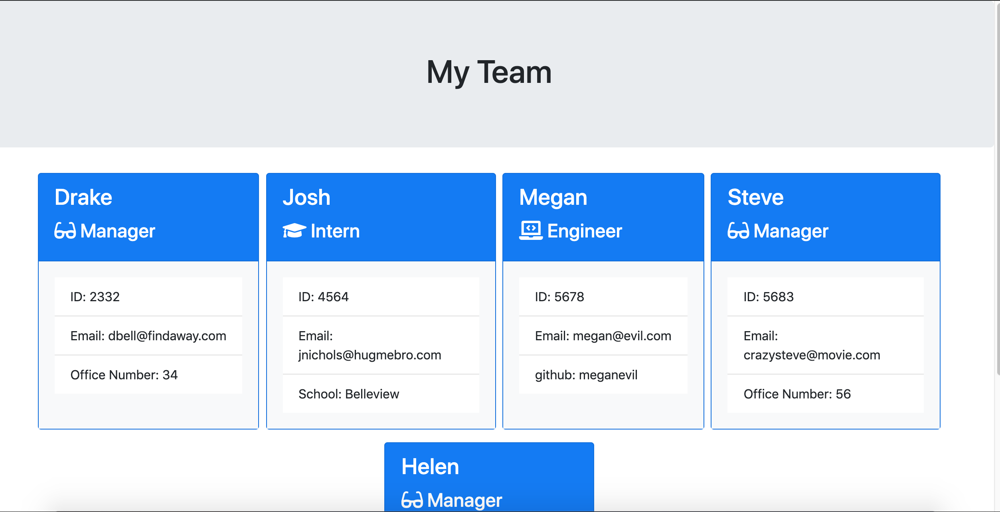

# Template-Engine

## Description

This project is about creating employee summarry cards for team members, so that the user can have easy access to basic information about his or team. This project incorporates multiple classes, inquirer npm and promises to carry out the process of creating multiple employee cards. The user will run a node command which will initialize the app.js file. There the file will ask the user questions about the team. The user will respond to these questions inside the terminal. Once the user enters all the team members, a html page will generate in the output folder that will contain the cards of the team members. 

This javascript code incorporates npm modules that commincate with websites and various other packages that make many javascipt functionalities easier to create. For this instance we were able to take data from asking multiple questions to the user and post that information in an html page that is easy to see. The simplicity of npm packages allows for the incorporation of many functions without many problems. I also used classes and promises, which really organized my code so that it is really easy to read. Additionally, being ablt to dynamically generate html pages with ease makes this easy to use.

## Table of Contents

* [Installation](#installation)
* [Usage](#usage)
* [Credits](#credits)
* [License](#license)

## Installation
1. Clone Repo
2. Open Terminal
3. type "npm install" in terminal
4. type "node app.js" in terminal
5. Answer prompts
6. Open team.html page in the outputs folder

## Usage 
The HTML page that is generated has the all the information of the team members. It is very convenient when the user wants to learn more about his or her team member.
## Credits

Thanks to UW Coding Boot Camp and our instructor Joe for guiding me through the process. Also, thank you to the TA who are there everyday to help.

W3school for many of their online sources on css and html.
https://www.w3schools.com/ 

Bootstrap Code
https://getbootstrap.com/

## License

Attribution-ShareAlike 4.0 International

=======================================================================